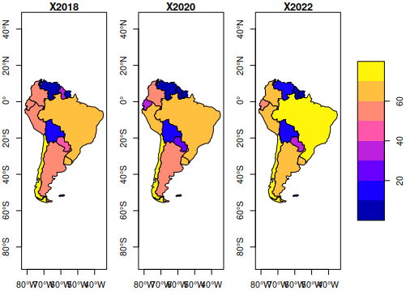

# JACOB
Multicriteria analysis and GIS applied to the selection of agroindustrial waste.

## ¿Qué es JACOB?
Es una herramienta ofimática presada para gobiernos locales (alcaidias, parroquias, municipios).
 * Está basada en la tesis doctoral de María Antonieto Rierra maria.riera@utm.edu.ec ORCID(s): 0000-0002-7195-2821

   Básicamente el flujo de trabajo implica realizar los siguientes pasos

   * install.packages("devtools")
   * install_github("JACOB",username="cealuncuyo")
   * aguarda unos minutos ...
   * library(JACOB)
   * demo_jacob

Con este demo te la plataforma te preguntará por la localización de las imagenes satelitares (raster)
Las capas en formato SF o Leaflet para importarlas al proyecto. Deberás al menos tener una capa de puntos con las localizaciones de las intalaciones industriales, una capa de vias de comunicación terretres o navegables y la densidad (ton/m3) o el rendimiento por hectarea de las manchas espectrales que aparecen en el satelite con los cultivos 

Luego comenzará la ronda de definición de residuos tipo a rankear, y los criterios de selección
Se procede luego a la comparación de pares y en paralelo se mostrará en una ventana web como progresa el ranking y el índice de incosistencia del torneo de consultas a expertos.

   
